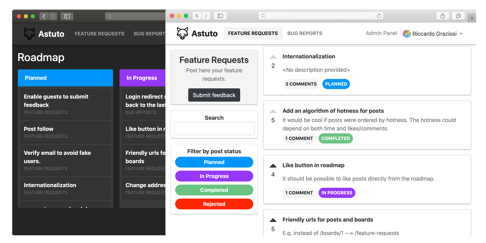

<p align="center"></p>
<p align="center">
  <a href="https://www.producthunt.com/posts/astuto?utm_source=badge-top-post-badge&utm_medium=badge&utm_souce=badge-astuto" target="_blank"></a>
  <br>
  <h3 align="center"><a href="https://docs.astuto.io/">📖 Documentation</a></h3>
</p>

## What is Astuto?

Astuto is an open source customer feedback tool. It helps you collect, manage and prioritize feedback from your customers, so you can build a better product.



## Features

* Collect and manage feedback
* Create custom boards and statuses, to better organize feedback
* Customize your roadmap, to let your users know what you're working on
* Many more...

## Requirements

* Docker
* Docker Compose

You can install [Docker Desktop](https://docs.docker.com/desktop/) which includes everything you need to run Astuto. If you are on Linux, you may instead install Docker Engine, Docker CLI and then install the [Docker Compose Plugin](https://docs.docker.com/compose/install/).

## Installation

### DockerHub image (fastest, for production)

1. Create an empty folder
2. Inside that folder, create a `docker-compose.yml` file with the following content:
```
version: '3.4'
services:
  db:
    image: postgres:14.5
    environment:
      POSTGRES_USER: yourpostgresusername
      POSTGRES_PASSWORD: yourpostgrespassword
    volumes:
      - dbdata:/var/lib/postgresql/data
  web:
    image: riggraz/astuto:latest
    environment:
      POSTGRES_USER: yourpostgresusername
      POSTGRES_PASSWORD: yourpostgrespassword
      BASE_URL: http://yourwebsite.com
      SECRET_KEY_BASE: yoursecretkeybase
    ports:
      - "3000:3000"
    depends_on:
      - db
    
volumes:
  dbdata:
```
3. Edit the environment variables to fit your needs
4. Run `docker compose pull`
5. Run `docker compose up`
6. You should now have a running instance of Astuto on port 3000. A default user account has been created with credentials email: `admin@example.com`, password: `password`.

**Note**: if you are on Linux and you encounter permission denied errors when running Docker commands, try to run them as administrator.

### GitHub repository (for development)

**Note**: this installation method is suggested for developers and contributors. If you just want to deploy your Astuto instance or try it out, we recommend to follow the above DockerHub installation instructions.

See [contributing guidelines](https://github.com/riggraz/astuto/blob/main/CONTRIBUTING.md).

## Contributing

You are welcome to contribute:
* Read our [contributing guidelines](https://github.com/riggraz/astuto/blob/main/CONTRIBUTING.md)
* Join the [Discord channel](https://discord.gg/SrtUMRp) to get in touch

## Credits

Astuto logo created by [Freepik Flaticon](https://www.flaticon.com/free-icons/fox).

A huge thank you to all people who contributed:

<a href="https://github.com/riggraz/astuto/graphs/contributors">
  
</a>
