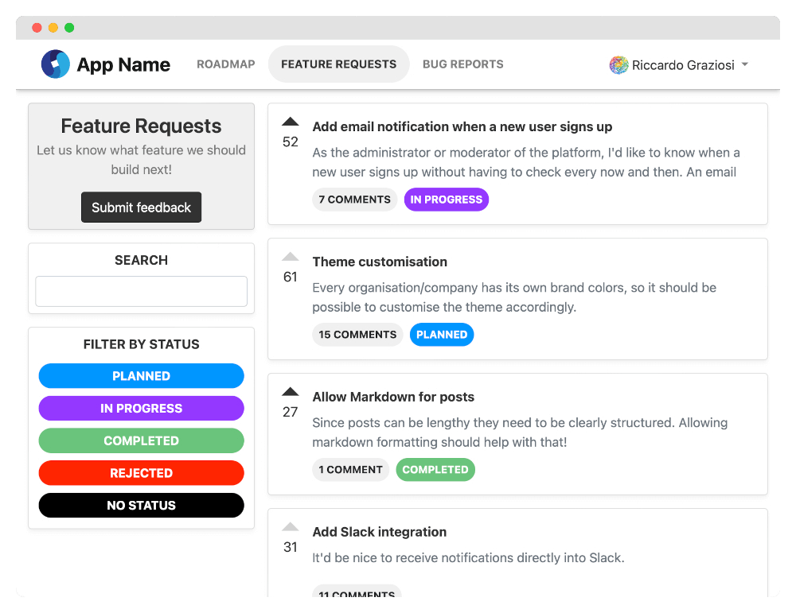

<p align="center">
  
</p>
<p align="center">
  <a href="https://www.producthunt.com/posts/astuto?utm_source=badge-top-post-badge&utm_medium=badge&utm_souce=badge-astuto" target="_blank"></a>
</p>

Astuto is an open source customer feedback tool. It helps you collect, manage and prioritize feedback from your customers, so you can build a better product.



## Features

- **Roadmap**: show users what you're working on
- **Simple Sign In**: let users log in with email or any OAuth2 provider
- **Webhooks**: integrate with your existing tools (e.g. Jira, Trello, Slack)
- **API**: programmatically manage your feedback space with our REST API
- **Moderation Queue**: decide whether to show new feedback immediately or request approval
- **Anonymous Feedback**: enable unregistered users to publish feedback
- **... and more**: invitation system, brand customization, recap emails for administrators, private site settings, and more!

## Documentation

Documentation website is not online anymore. You can read Astuto's documentation from the [GitHub repository](https://github.com/astuto/astuto-docs).

## Get started

0. Ensure you have Docker and Docker Compose installed
1. Create an empty folder
2. Inside that folder, create a `docker-compose.yml` file with the following content:
```
services:
  db:
    image: postgres:14.5
    environment: &db-env
      POSTGRES_USER: yourpostgresusername
      POSTGRES_PASSWORD: yourpostgrespassword
    volumes:
      - dbdata:/var/lib/postgresql/data
  web:
    image: riggraz/astuto:latest
    environment:
      <<: *db-env
      BASE_URL: http://yourwebsite.com
      SECRET_KEY_BASE: yoursecretkeybase
    ports:
      - "3000:3000"
    depends_on:
      - db
    
volumes:
  dbdata:
```
3. Edit the environment variables to fit your needs
4. Run `docker compose pull && docker compose up`
5. You should now have a running instance of Astuto on port 3000. A default user account has been created with credentials email: `admin@example.com`, password: `password`.

## Contributing

There are many ways to contribute to Astuto, not just coding. Proposing features, reporting issues, translating to a new language or improving documentation are a few examples! Please read our [contributing guidelines](https://github.com/riggraz/astuto/blob/main/CONTRIBUTING.md) to learn more.

## Credits

Astuto logo and all image assets are credited [here](https://github.com/astuto/astuto-io/blob/main/src/pages/Credits.jsx).

A huge thank you to code contributors

<a href="https://github.com/riggraz/astuto/graphs/contributors">
  
</a>

and [translation contributors](https://crowdin.com/project/astuto/members)!
